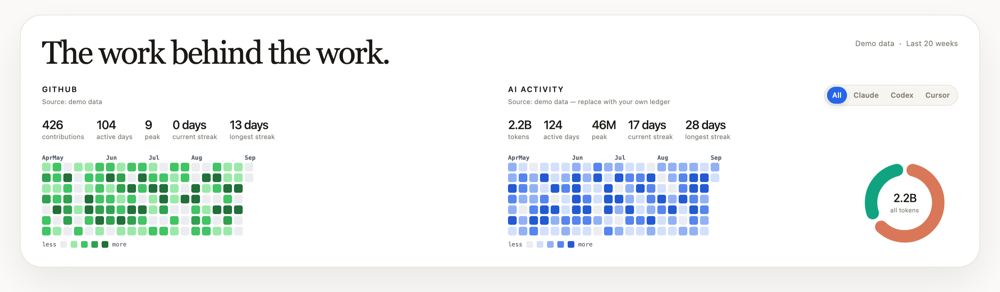
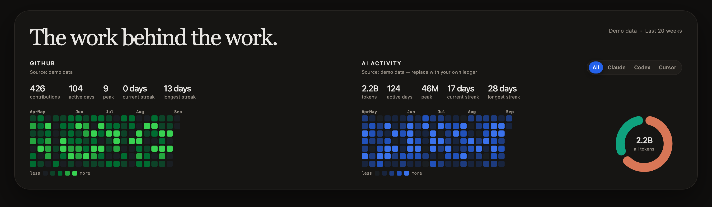

# Activity Heatmap

An open-source, data-driven activity heatmap for portfolio sites. It puts your
GitHub contributions and your local AI coding activity — Claude Code, Codex,
and Cursor — on one card.




*The screenshots show the optional card chrome. Out of the box the component
renders just the charts — see [Layout](#layout).*

It ships as:

1. A React component that renders the GitHub + AI activity card.
2. A local CLI that turns aggregate usage metadata from your machine into the
   JSON the component needs.

The component works immediately with demo data. Real data is opt-in and stays
on your machine until you choose to publish the generated aggregate JSON.

## Quick start

Install it in the website where the graph should appear:

```bash
npm install github:tb962/activity-heatmap
```

Create a local config and put in your GitHub username:

```bash
npx activity-graph init --username your-github-username
```

Authenticate GitHub once. Either use the GitHub CLI:

```bash
gh auth login
```

or set a token for the sync command:

```bash
export GITHUB_TOKEN=github_pat_...
```

Generate the aggregate data:

```bash
npx activity-graph doctor
npx activity-graph sync
```

Then render it in React:

```tsx
import activity from "./data/activity.json";
import {
  ActivityGraph,
  type ActivityDataset,
} from "@tb962/activity-heatmap";
import "@tb962/activity-heatmap/styles.css";

export function WorkBehindTheWork() {
  return <ActivityGraph data={activity as ActivityDataset} />;
}
```

For Next App Router, import the stylesheet once from `app/layout.tsx`. The
component already declares its client boundary, so the page can remain a
Server Component and pass the JSON as serializable props.

Without a `data` prop, `<ActivityGraph />` renders the built-in deterministic
demo. For GitHub-only sites, use `showAi={false}` or pass a dataset without an
`ai` section.

## Layout

The package ships charts, not a layout. By default there is no card, no
border, no heading and no meta line — just the grids, so the component drops
into your own design without anything to override:

```tsx
<ActivityGraph data={activity} />
```

Every piece of chrome is opt-in. To rebuild the card in the screenshots:

```tsx
<ActivityGraph
  data={activity}
  title="The work behind the work."
  card
  showMeta
/>
```

| Prop | Default | Adds |
| --- | --- | --- |
| `title` | none | Heading above the charts. Accepts any node. |
| `showMeta` | `false` | "Updated <date> · Last N weeks" |
| `card` | `false` | Border, padding, background, shadow |
| `showColumnLabels` | `true` | "GITHUB" / "AI ACTIVITY" and source lines |
| `showStats` | `true` | Totals row above each calendar |
| `showLegend` | `true` | less/more colour key |
| `showDonut` | `true` | Provider breakdown ring |
| `showProviderToggle` | `true` | All/Claude/Codex/Cursor switcher |
| `showAi` | `true` | The AI column |

Strip it back to a single bare grid:

```tsx
<ActivityGraph
  data={activity}
  showAi={false}
  showColumnLabels={false}
  showStats={false}
  showLegend={false}
/>
```

## Appearance

```tsx
<ActivityGraph
  data={activity}
  cellShape="circle"
  cellSize={15}
  cellGap={4}
  colors={{ github: "#8b5cf6", claude: "#d97757" }}
/>
```

| Prop | Default | Notes |
| --- | --- | --- |
| `cellShape` | `"rounded"` | `"rounded"`, `"square"` or `"circle"` |
| `cellSize` | `13` | Pixels per day cell |
| `cellGap` | `3` | Pixels between cells |
| `colors` | — | Base colour per view: `github`, `all`, `claude`, `codex`, `cursor`. Each is a hex seed; the four shades are derived from it. |
| `levelColors` | — | Replace the derived ramp outright, palest first |
| `emptyColor` | — | Colour of a day with no activity |

Anything not covered by a prop is a CSS custom property — see
[Theming](#theming).

### Playground

Every control above, wired to a live graph with a copy-paste snippet:

```bash
npm run build
npx serve .        # or any static server
```

Then open `examples/playground.html`. It needs a network connection, because
it pulls React from a CDN rather than bundling one.

## Theming

The graph follows the visitor's OS setting by default. Force one palette with
the `theme` prop:

```tsx
<ActivityGraph theme="dark" />   // always dark
<ActivityGraph theme="light" />  // always light
<ActivityGraph />                // "system" — follows prefers-color-scheme
```

Every colour is a CSS custom property on `.activity-graph`, so you can restyle
it without forking the stylesheet:

```css
.activity-graph {
  --activity-graph-card: #fffdf8;
  --activity-graph-ink: #1a1815;
  --activity-graph-github-4: #216e39;
}
```

## What `sync` reads

The CLI reads only aggregate usage metadata. It never copies prompts,
transcripts, or raw log files into the generated data.

| Source | What it reads | Metric |
| --- | --- | --- |
| GitHub | Contribution calendar via `GITHUB_TOKEN` or `gh auth token`. | contributions |
| Claude Code | `~/.claude/projects/**/*.jsonl` | tokens |
| Codex | `~/.codex/sessions/**/*.jsonl` and archived sessions | tokens |
| Cursor | Cursor's own local databases | messages, AI edits, or edited lines |

Every source is optional. If one is missing the sync keeps going and reports a
warning; if you have none of them, the component still renders with demo data
or an explicit empty state.

### How Cursor is measured

Claude Code and Codex write token counts into their own session logs. Cursor
does not: token counts live only in your Cursor cloud account, and the
`tokenCount` field in its local database is filled in on roughly 1 message in
5,000, so it cannot be charted.

Rather than reach for your Cursor credentials, this package reads what Cursor
already stores on disk. Two databases matter:

```
~/Library/Application Support/Cursor/.../state.vscdb   conversations
~/.cursor/ai-tracking/ai-code-tracking.db              AI-written code events
```

`cursorMetric` picks what to chart:

| Value | Counts | Accuracy | History |
| --- | --- | --- | --- |
| `auto` (default) | `messages`, else `aiEdits` | — | — |
| `messages` | messages per day | day, per conversation | months |
| `aiEdits` | blocks of AI-written code | exact timestamp | ~2-week window |
| `edits` | lines added + removed | day, per conversation | months |

`auto` picks `messages` because Cursor's conversation database goes back
months while it prunes AI-edit tracking to a rolling window. Both are accurate
enough for a daily grid — exact per-edit timestamps only change the picture
for a thread spanning midnight — so coverage decides.

Choose `aiEdits` if you would rather count AI-written code than conversation
volume. It is the more precise signal and it excludes anything you typed
yourself, but it starts near-empty and fills in from your first sync onward.
That is fine: the collector keeps its own history file, so once a day is
recorded it stays, whatever Cursor later prunes.

Once a metric has been recorded, `auto` keeps it. Switching unit discards the
values stored under the old one — 4 messages and 22,000,000 tokens cannot
share a scale — so only an explicit config change may do that.

Because Cursor's unit is not tokens, it never joins a day's token total. The
**All** view and the donut aggregate the token providers; Cursor gets its own
tab with its own label.

Reading these databases needs SQLite. Node 22.5+ has it built in; older
versions fall back to the `sqlite3` CLI. Both reads are read-only and take no
lock, so they work while Cursor is open.

### No account access, ever

The collector reads local files and calls exactly one network endpoint:
GitHub's GraphQL API, with a token you supply. It never reads credentials for
Claude, Codex, or Cursor, never touches your Keychain, and never calls a
vendor's private API. Anything it cannot learn from a file on disk, it does
not report.

## Reading the heatmap

Shade bands are cut at quantiles of your active days rather than at fractions
of your busiest day. Token counts are heavy-tailed — one long day can be 20x
the median — so scaling against the maximum collapses most of the calendar
into the palest shade. Quantiles keep all four shades in use whatever the unit
is.

Days outside a provider's known coverage render at half opacity and are marked
`n/a` in the legend, so a gap in the data never reads as a day off.

## Daily updates

On macOS, install a user-level launchd job that runs once a day:

```bash
npx activity-graph schedule
```

Remove it with:

```bash
npx activity-graph unschedule
```

On Linux or Windows, run `npx activity-graph sync` from the operating system's
normal scheduler. The collector has no server requirement.

## Configuration

`activity.config.json` is created by `init`:

```json
{
  "github": { "username": "your-github-username" },
  "timezone": "auto",
  "rangeDays": 365,
  "historyDays": 730,
  "output": "data/activity.json",
  "historyOutput": "data/ai-activity-history.json",
  "cursorMetric": "auto",
  "sources": {
    "github": true,
    "codex": true,
    "claude": true,
    "cursor": true
  }
}
```

All paths are relative to the project containing the config. Environment
variables override the matching values for CI or a one-off sync:

```text
GITHUB_USERNAME
GITHUB_TOKEN or GH_TOKEN
ACTIVITY_TIMEZONE
ACTIVITY_RANGE_DAYS
ACTIVITY_CURSOR_METRIC   auto | messages | aiEdits | edits
AI_HISTORY_RETENTION_DAYS
```

To feed Cursor data from somewhere else — a cloud export, another editor —
set `cursorFile` to a JSON file of `{ "days": [{ "date": "2026-09-07",
"tokens": 42 }] }`. It takes precedence over the database.

## Privacy boundary

The browser component is deliberately a renderer. It cannot safely read a
visitor's local filesystem, AI logs, or API keys. The local CLI is the only
part that touches those sources, and it emits only daily aggregates:

```json
{
  "date": "2026-09-07",
  "providers": { "claude": 1200000, "codex": 800000, "cursor": 24 },
  "totalTokens": 2000000
}
```

Review `data/activity.json` before committing it to a public portfolio. This
repository ignores generated personal data by default; the example contract is
at [data/activity.example.json](data/activity.example.json).

## Development

```bash
npm install
npm run typecheck
npm test
npm run build
```

The collector tests use fixture logs, fixture SQLite databases, and a mocked
GitHub response. They never read your real home directory.

To regenerate the screenshots above and a browsable preview page:

```bash
npm run preview
```

`examples/playground.html` is the interactive version; it reads `dist/`
directly, so run `npm run build` first and serve the folder over HTTP.

## License

MIT. See [LICENSE](LICENSE).
